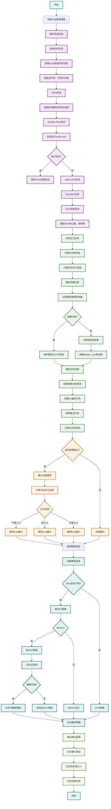

```mermaid
graph TD
    A[开始] --> B[初始化设备管理器]
    B --> C[硬件检测阶段]
    C --> D[系统内存检测]
    D --> E[使用psutil获取内存信息]
    E --> F[获取总内存、可用内存等]
    F --> G[GPU检测]
    G --> H[智能检测器检测所有设备]
    H --> I[NVIDIA GPU检测]
    I --> J[尝试执行nvidia-smi]
    J --> K{执行成功?}
    K -->|是| L[解析GPU详细信息]
    K -->|否| M[AMD GPU检测]
    M --> N[DirectML检测]
    N --> O[CPU信息检测]
    O --> P[获取CPU核心数、架构等]
    P --> Q[内存压力分析]
    Q --> R[计算总可用内存]
    R --> S[计算内存压力等级]
    S --> T[模型参数估算]
    T --> U[从配置获取模型参数]
    U --> V{配置可用?}
    V -->|是| W[解析模型大小字符串]
    V -->|否| X[从模型架构估算]
    X --> Y[根据hidden_size等估算]
    W --> Z[模型内存估算]
    Y --> Z
    Z --> AA[估算参数内存需求]
    AA --> AB[估算KV缓存内存]
    AB --> AC[估算激活内存]
    AC --> AD[计算总内存需求]
    AD --> AE{是否需要量化?}
    AE -->|是| AF[量化位数推荐]
    AE -->|否| AG[无需量化]
    AF --> AH[计算内存压力比例]
    AH --> AI{压力程度}
    AI -->|严重>1.5| AJ[推荐2-bit量化]
    AI -->|高>1.0| AK[推荐4-bit量化]
    AI -->|中等≤1.0| AL[推荐8-bit量化]
    AJ --> AM[推理策略选择]
    AK --> AM
    AL --> AM
    AG --> AM
    AM --> AN[设备策略选择]
    AN --> AO{GPU是否可用?}
    AO -->|是| AP[单GPU策略]
    AP --> AQ{多GPU?}
    AQ -->|是| AR[多GPU策略]
    AQ -->|否| AS[单GPU优化]
    AO -->|否| AT[CPU策略]
    AR --> AU[分布式检测]
    AU --> AV{集群环境?}
    AV -->|是| AW[分布式集群策略]
    AV -->|否| AX[本地多GPU策略]
    AW --> AY[生成最终策略]
    AX --> AY
    AS --> AY
    AT --> AY
    AY --> AZ[输出建议配置]
    AZ --> BA[包含量化建议]
    BA --> BB[包含批处理大小]
    BB --> BC[包含设备信息]
    BC --> BD[结束]

    %% 节点样式
    classDef startEnd fill:#e1f5fe,stroke:#01579b,stroke-width:2px;
    classDef hardware fill:#f3e5f5,stroke:#4a148c,stroke-width:2px;
    classDef memory fill:#e8f5e8,stroke:#1b5e20,stroke-width:2px;
    classDef quantization fill:#fff3e0,stroke:#e65100,stroke-width:2px;
    classDef strategy fill:#e0f2f1,stroke:#004d40,stroke-width:2px;
    classDef output fill:#f1f8e9,stroke:#33691e,stroke-width:2px;
    
    class A,BD startEnd;
    class C,D,E,F,G,H,I,J,K,L,M,N,O,P hardware;
    class Q,R,S,T,U,V,W,X,Y,Z,AA,AB,AC,AD memory;
    class AE,AF,AH,AI,AJ,AK,AL,AG quantization;
    class AN,AO,AP,AQ,AR,AS,AT,AU,AV,AW,AX,AY strategy;
    class AZ,BA,BB,BC output;
```